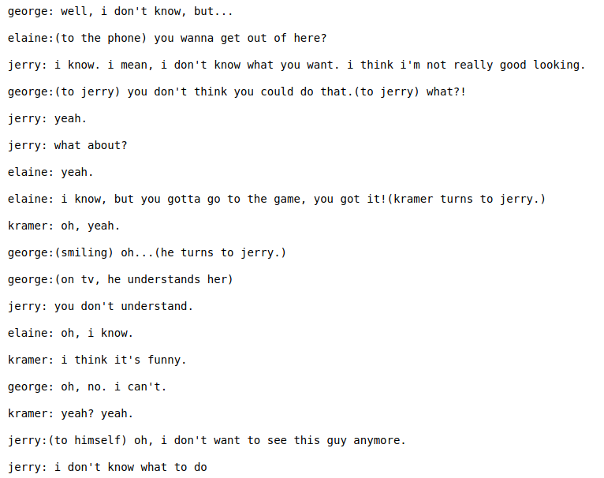

# TV-Script-Generation
This repo contains an PyTorch implementation of a LSTM to generate a TV Script.
The network generates [Seinfeld](https://en.wikipedia.org/wiki/Seinfeld) TV Script after learning from its scripts as input data.

## Network Architecture
  - Embedding layer of 400 dimension
  - Two LSTM layers stacked each of dimension 256
  - Fully Connected Layer
  
## Generated TV Script

